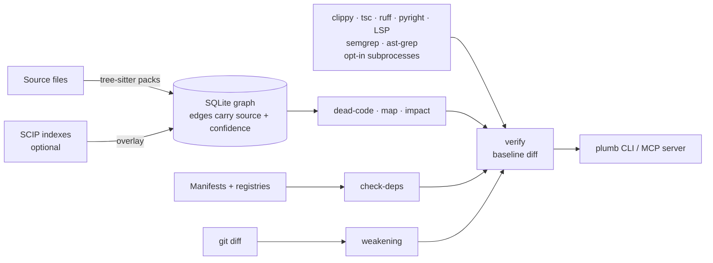

<p align="center"></p>

<h1 align="center">Plumbgraph</h1>

<p align="center"><b>Know your code. Verify the change.</b><br>
Local code intelligence and a pre-submit gate for AI coding agents, over CLI and MCP.</p>

<p align="center">
<a href="https://github.com/grloper/plumbgraph/actions/workflows/ci.yml"></a>
<a href="LICENSE"></a>


</p>

<p align="center"></p>
<p align="center"><sub>Real output of <code>plumb verify</code> on <a href="examples/demo-app">examples/demo-app</a> (captured by <code>scripts/render-demo.py</code>; raw text in <a href="docs/demo/verify.txt">docs/demo/verify.txt</a>).</sub></p>

## Why

AI agents write code fast and check it badly. Plumbgraph answers the questions an agent should ask **before** it says "done", and says how sure it is:

- **Is this code used?** `dead-code`, with reachability evidence and false-positive risks.
- **Is this dependency real?** `check-deps` compares imports with your manifests and, optionally, PyPI / npm / crates.io, so a hallucinated package is caught.
- **Did the tests get weaker?** `weakening` reads `git diff` for deleted tests, new skips and loosened assertions.
- **What breaks if I change this?** `impact` lists transitive callers and the tests to run; `map` gives a token-budgeted overview.
- **One verdict.** `verify` merges all of that with diagnostics, semgrep and ast-grep, diffs against a baseline, and fails only on **new** findings.

It indexes with tree-sitter into a local SQLite file, executes none of your code by default, and every finding carries a `source` and a `confidence`.

## Quickstart

Nothing is published yet (no crate, no binaries). Build from source with Rust 1.85+:

```bash
git clone https://github.com/grloper/plumbgraph && cd plumbgraph
cargo install --path crates/cli --locked      # installs `plumb` (and `plumbgraph`)

plumb map . --tokens 1500         # ranked overview under a hard token budget (--budget is an alias)
plumb dead-code .                 # add --lib for libraries (exports = public API)
plumb check-deps . --online       # sends package names only to the registries
plumb verify .                    # one pass/fail gate (exit 1 on new findings)
plumb verify . --run --online     # also run diagnostics, semgrep, ast-grep (trusted code only)
plumb init --dry-run              # preview: AGENTS.md block, MCP config, .gitignore lines
plumb init                        # write them
```

In a git work tree `plumb init` adds `.plumbgraph/*` and `!.plumbgraph/allow.toml` to `<project>/.gitignore` (the index is a local cache; the allow-list is meant to be committed). An existing `.plumbgraph` entry is left alone, a `.gitignore` that is not UTF-8 is never rewritten, and `--no-gitignore` skips this step.

`--json` on any command gives machine-readable output; `--fail-on high|medium|low` sets the exit code.

### Windows

The same `cargo install --path crates/cli --locked` works from PowerShell; it puts `plumb.exe` and `plumbgraph.exe` in `%USERPROFILE%\.cargo\bin`. The rustup installer adds that directory to `PATH`; other Rust installs (Chocolatey, for example) do not, and `cargo install` then prints `be sure to add ...\.cargo\bin to your PATH`. Add it for your user and open a new terminal:

```powershell
$bin = "$env:USERPROFILE\.cargo\bin"
$user = [Environment]::GetEnvironmentVariable('Path', 'User')
if (($user -split ';') -notcontains $bin) {
  [Environment]::SetEnvironmentVariable('Path', ($user.TrimEnd(';') + ';' + $bin), 'User')
}
# new terminal:
plumb --version
plumb doctor .
```

What was tested on Windows, and only this: Windows 11 Home 64-bit (build 26200) with Rust 1.91.1 `x86_64-pc-windows-gnu` from Chocolatey (no rustup, so `rust-toolchain.toml`'s 1.85 was not used, and the MSVC target was not tried). `cargo install --path crates/cli --locked` built and installed both v1.0.0 and the v1.0.1 changes. On one real repository, v1.0.0 ran `index`, `map`, `dead-code`, `check-deps`, `verify`, `weakening`, `doctor` and `plumb mcp` (driven by one MCP host), and the v1.0.1 build ran `doctor`, `map --budget` and `init --dry-run`. `cargo test --workspace` on that machine: every test passes except 10 that also fail on `main` there (LSP/diagnostics tests that need a real `python3`, which was only the Microsoft Store stub, and the closed-stdout-pipe test, which gets Windows error 232 instead of a broken pipe). CI runs on Linux only.

### Use with an agent (MCP)

```bash
claude mcp add plumbgraph -- plumb mcp --root /path/to/project
```

Or in `.cursor/mcp.json`, Claude Desktop and other `mcpServers` clients:

```json
{ "mcpServers": { "plumbgraph": { "command": "plumb", "args": ["mcp", "--root", "/path/to/project"] } } }
```

13 tools and 3 resources; running external tools is refused unless **you** start the server with `--allow-exec`. Details and the clients it was actually tested with: [docs/MCP.md](docs/MCP.md).

## See it work

| | |
|---|---|
| **Map and impact** |  |
| **SCIP makes it precise** |  |

All images are renderings of real runs; regenerate them with `scripts/render-demo.py`.

## How it works



More in [docs/ARCHITECTURE.md](docs/ARCHITECTURE.md).

## What works

| Capability | Languages | Notes |
|---|---|---|
| `index`, `find`, `refs` | Python, JavaScript, TypeScript/TSX, Rust, Go, Java, C# | Tier-0 (tree-sitter, name-based). Import resolution varies by language; C# imports are not resolved to files. |
| `dead-code` | same | Reachability from entry points and tests; confidence 0-1; `--lib`, allow-list (`.plumbgraph/allow.toml`), `plumb:keep` comments; evidence and false-positive risks per finding. |
| `check-deps` | Python, JS/TS, Rust | Imports vs manifests; registry existence checks are opt-in (`--online`), and registry errors are never reported as "does not exist". |
| `weakening` | any language with test files | Heuristic, line-based `git diff` analysis. |
| `map`, `impact` | all of the above | PageRank-ranked map under a hard token budget; reverse reachability with tests to run. |
| `verify`, `doctor`, `enrich`, `init` | | Baseline-diffing gate; provider detection; opt-in SCIP indexers; agent config writer. |
| SCIP overlay | rust-analyzer, scip-typescript, scip-python indexes | Compiler-grade edges where the index resolved a reference, per-reference fallback ([docs/SCIP.md](docs/SCIP.md)). Exercised on toy projects with scip-python and scip-typescript. |
| Diagnostics | Rust, TS/JS, Python, any LSP | Normalised cargo/clippy, tsc, pyright, ruff, LSP `publishDiagnostics` ([docs/DIAGNOSTICS.md](docs/DIAGNOSTICS.md)). |
| Rule engines | semgrep, ast-grep | Run as subprocesses with `--run`; semgrep needs `.semgrep.yml` or `--semgrep-config`, ast-grep needs `sgconfig.yml`. |

## How it compares

Facts below come from each project's own README/docs on 2026-10-10 (links in [docs/LANDSCAPE.md](docs/LANDSCAPE.md)); we did not benchmark any of them, and "not documented" means we did not find it, not that it is absent. Star counts are not used.

| | **Plumbgraph** | [Serena](https://github.com/oraios/serena) | [CodeGraph](https://github.com/colbymchenry/codegraph) | [Aider repo map](https://aider.chat/docs/repomap.html) | [Sourcegraph](https://sourcegraph.com/docs/code-navigation) |
|---|---|---|---|---|---|
| Main job | Verify a change (dead code, fake deps, weakened tests) plus navigation | Semantic retrieval and editing for agents | Pre-indexed code knowledge graph for agents | Give the LLM a ranked map of the repo | Code search and navigation platform |
| How it analyses | tree-sitter; optional SCIP and LSP-diagnostics overlays | Language servers (LSP) | Local code graph (see its docs for details) | tree-sitter definitions/references, graph ranking | Search-based, plus precise navigation from SCIP indexes |
| Interface | CLI, MCP (stdio) | MCP | MCP, CLI | Inside aider | Web UI, API; MCP server on the enterprise plan |
| Runs locally, no service | Yes | Yes | Yes ("100 % local") | Yes | Self-hosted or single-tenant cloud |
| Dead-code / hallucinated-dependency / test-weakening checks | Yes | Not documented | Not documented | No (not its purpose) | Not documented |
| Confidence and source on every result | Yes | Not documented | Not documented | n/a | n/a |
| Precise cross-references | Only with a SCIP index; name-based otherwise | Yes, via LSP | Not verified | Not type-resolved (tree-sitter) | Yes, with SCIP indexes |
| License | Apache-2.0 | GPL-3.0-or-later (app), per its README | MIT | Apache-2.0 | Commercial (enterprise from $16K/year, pricing page) |

Use them together: if you need precise navigation and editing today, an LSP-backed tool such as Serena will beat our tier-0 graph; Plumbgraph's niche is the verification side and honest provenance.

## What does not work yet

- Without a SCIP index, analysis is **name-based**: no types, no cross-language edges; common names give ambiguous, lower-confidence edges.
- **Dead-code precision is low on libraries in the default (app) mode** and recall is unmeasured on real code. Hand review of 76 findings on chi and gson found 1 real unused function; four systematic false-positive classes were fixed ([docs/EVALUATION.md](docs/EVALUATION.md)). Use `--lib` for libraries.
- Reflection, `eval`, DI containers, macros and framework magic are invisible (they lower confidence but are not understood).
- Go, Java, C# are tier-0 only; C# was not benchmarked on a real repository.
- SCIP: rust-analyzer's SCIP output, scip-go, scip-java and scip-dotnet were not run; scip-python and scip-typescript only on toys.
- MCP: stdio only, tools and resources only (no prompts). Tested with the official TypeScript SDK and the MCP inspector CLI; agent hosts were not tested.
- `weakening` is line-based and heuristic. Windows: one machine, manual runs, no CI (see [Windows](#windows)). No releases or packages yet.

## Documentation

[Docs index](docs/README.md) · [Architecture](docs/ARCHITECTURE.md) · [MCP](docs/MCP.md) · [SCIP](docs/SCIP.md) · [Diagnostics](docs/DIAGNOSTICS.md) · [Language packs](docs/PACKS.md) · [Evaluation](docs/EVALUATION.md) · [Landscape](docs/LANDSCAPE.md) · [Changelog](CHANGELOG.md)

## Development

```bash
scripts/verify.sh            # fmt, clippy -D warnings, tests, test-integrity, cargo-deny/audit if installed
plumb verify .               # plumbgraph checks itself (allow-list with reasons in .plumbgraph/allow.toml)
```

See [CONTRIBUTING.md](CONTRIBUTING.md), [AGENTS.md](AGENTS.md) and [SECURITY.md](SECURITY.md). Licensed under [Apache-2.0](LICENSE).
