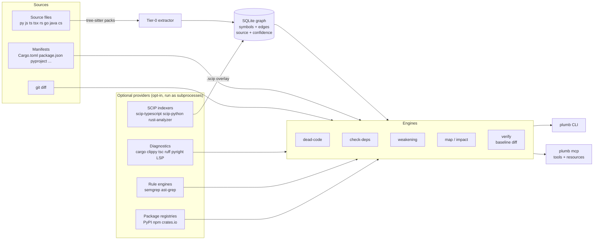

# Architecture

* **Tier 0** (always on): tree-sitter extraction into a local SQLite file (`.plumbgraph/index.db`), incremental by content hash and mtime. Edges are name-resolved and carry a confidence.
* **Tier 1** (if you have an index): a SCIP overlay replaces name-based edges with compiler-grade ones per occurrence and falls back per reference ([SCIP.md](SCIP.md)).
* **Providers** run only when you ask (`--run`, `plumb enrich`, MCP `--allow-exec`); their output is normalised into the same finding model (`source`, `confidence`, `level`, `evidence`, `fp_risks`).
* **verify** merges every engine, diffs against `plumb-baseline.json` and fails only on *new* findings at or above `--fail-on`.

Crates: `plumbgraph-langs` (pack loader + grammars), `plumbgraph-core` (extraction, store, engines, `ops` shared by CLI and MCP), `plumbgraph-mcp` (hand-rolled stdio server), `plumbgraph-cli` (the `plumb` binary).
